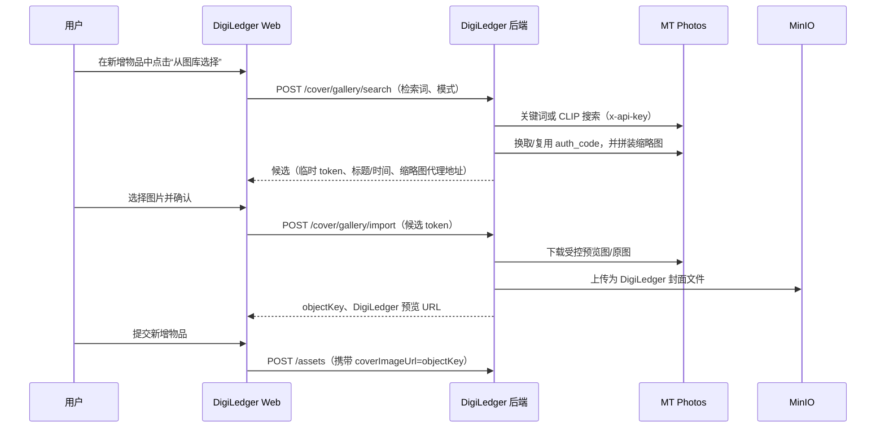

# MT Photos 图库选图设封面：需求与可行性分析

## 1. 结论

**具备实现条件，建议实施。** MT Photos 已提供受 API Key 保护的图库检索、CLIP 语义检索、缩略图和原图读取接口；DigiLedger 也已有上传文件到 MinIO 并将 `objectKey` 写入 `coverImageUrl` 的完整能力。

本功能的正确定位是：**从用户自己的 MT Photos 图库中选择照片作为物品封面**。它不是根据商品标题在互联网搜索商品图片的服务；若图库中不存在相关照片，MT Photos 不会返回结果。现有 Bing/Google“智能找图”可继续作为另一个、面向互联网图片搜索的入口。

新增物品尚未保存时也可完成选图：选择结果后先由 DigiLedger 后端导入至 MinIO，得到 `objectKey`；用户最后提交“新增物品”时，将该 `objectKey` 一并写入封面字段。不需要提前创建一条空物品记录。

## 2. 调研范围与事实依据

调研时间：2026-07-22。

- MT Photos API 文档地址：[https://mtmt.tech/api/](https://mtmt.tech/api/)。文档默认演示服务为 `https://demo.mtmt.tech`，实测其服务版本为 `1.55.0 #96ABE`；实际接入时替换为用户自己的 MT Photos 服务地址。
- MT Photos 以 `x-api-key: sk_live_xxx` 或 Bearer JWT 鉴权。页面图片不宜直接暴露 API Key：需先调用 `POST /auth/auth_code`，使用 API Key 换取有效期 24 小时的 `auth_code`，再把它带入图片 URL。
- `POST /gateway/search`：普通关键词检索，请求字段含 `key`，可按文件名、元数据等已索引信息匹配；返回扁平 `list` 和 `totalCount`。
- `POST /gateway/searchCLIP`：文本语义检索，请求字段为 `key`、可选 `count` 和 `imgId`；返回 `list` 和 `totalCount`。
- `POST /gateway/CLIP_status`：返回 `{ active: boolean }`，用于判断语义检索是否可用。
- `GET /gateway/{type}/{md5}`：读取缩略图（可使用 `h220`），需要 `auth_code`；`GET /gateway/file/{id}/{md5}` 可读取预览图或原图，也需要 `auth_code`。
- MT Photos 的 CLIP 搜索依赖图库已完成智能识别/向量索引，并且智能识别 API 处于可用状态；官方说明可通过中文物品或场景描述检索图库照片。[MT Photos 智能识别说明](https://mtmt.tech/docs/advanced/ocr_api/)
- 当前项目已有“智能找图设封面”：`CoverSuggestionDialog.vue` 和 `/api/assets/{assetId}/cover/*`。但它仅支持**已保存物品**，候选来自购买链接、Bing/Google 等外部图搜，选图后才下载到对象存储。新增物品页的按钮也因此被 `!form.id` 禁用。
- 当前项目的新增物品接口已能接收 `coverImageUrl`（对象存储 `objectKey`），并且 `/api/files/upload` 可将文件写入 MinIO。因此无需改表或修改资产创建的数据结构。

## 3. 目标与边界

### 3.1 目标

在 PC Web 的“新增物品”表单的“封面图”区域增加“从 MT Photos 图库选择”入口：

1. 自动使用已填写的“物品名称 + 品牌 + 型号 + 分类”生成初始检索词；用户也可任意修改。
2. 支持“关键词匹配”和“智能语义（CLIP）”两种检索方式；当 CLIP 未启用时，语义模式不可选并解释原因。
3. 展示可滚动的缩略图网格，用户单选一张，确认后作为当前表单封面预览。
4. 用户提交新增物品时，所选图片已存在于 DigiLedger 的对象存储，封面正常持久化。
5. 编辑物品时复用相同选择器，选图确认后立即更新封面；保留现有“互联网智能找图”入口，不改变其行为。

### 3.2 非目标

- 不通过 MT Photos 搜索互联网或电商平台图片。
- 不将 DigiLedger 上传的文件自动回写、同步或删除 MT Photos 图库。
- 首期不做图库相册/人物/地点/标签等高级筛选，也不做批量设封面。
- 首期只接入 PC Web；UniApp/移动 Web 是否同步接入作为后续需求单独排期。

## 4. 用户流程

## 5. 详细功能需求

### 5.1 入口与交互

- 新增物品表单：在当前“上传封面”区新增次级按钮“从图库选择”；不依赖 `form.id`，物品名称为空时仍可打开，但搜索按钮禁用并提示先填写检索词。
- 编辑物品表单：同样展示该入口；确认导入成功后直接更新当前资产的封面。
- 弹窗标题为“从 MT Photos 图库选择”。包含检索输入框、模式切换、搜索按钮、结果网格、加载/空结果/错误状态。
- 初始检索词按“物品名称、品牌、型号、分类”拼接；用户输入优先于自动词。
- 默认模式为“关键词”。若 CLIP 可用，用户可切换“智能语义”；CLIP 不可用时禁用选项并展示“请在 MT Photos 完成智能识别后启用”。
- 每次最多返回 30 张；支持“加载更多”仅在接口或实际验证证明可分页后加入，首期无需假设 MT Photos 搜索结果可安全分页。
- 点击候选先显示选中态，再点“设为当前封面”完成导入；导入期间禁止重复提交。
- 导入失败时保留搜索结果和用户输入，允许重试或改用本地上传。

### 5.2 配置与权限

在 DigiLedger 系统设置增加“MT Photos 图库”配置卡：

| 字段 | 必填 | 说明 |
| --- | --- | --- |
| 服务地址 | 是 | 例如 `https://photos.example.com`，不得使用文档演示地址作为生产默认值 |
| API Key | 是 | 在 MT Photos 网页端创建的 `sk_live_...`；只允许后端读取，界面仅展示脱敏值 |
| 启用状态 | 是 | 未启用时隐藏图库入口或显示“管理员未配置” |
| 默认搜索模式 | 否 | `KEYWORD` 或 `CLIP`；CLIP 不可用时自动降级为关键词 |
| 结果上限 | 否 | 默认 30，服务端限制最大 50 |
| 可访问图库 | 否 | 首期不传 `galleryIds`；后续按 MT Photos API 验证后支持范围限制 |

- API Key 必须由 DigiLedger 后端持有，禁止下发浏览器、写入前端构建产物或日志。
- 配置保存前提供“连通性测试”：至少验证 MT Photos 的服务信息、鉴权、普通搜索，以及 CLIP 状态。
- 配置值建议使用部署环境变量覆盖，例如 `DL_MTPHOTOS_BASE_URL`、`DL_MTPHOTOS_API_KEY`；若允许后台保存密钥，必须采用现有密钥加密机制或新增加密存储方案。

### 5.3 后端接口（建议合同）

所有接口位于 DigiLedger，自身沿用现有登录/权限模型；浏览器不直接访问 MT Photos。

| 方法 | 建议路径 | 用途 |
| --- | --- | --- |
| `GET` | `/api/gallery-cover/status` | 返回是否已配置、连通、CLIP 可用、默认模式；不返回密钥 |
| `POST` | `/api/gallery-cover/search` | 请求 `{ query, mode: KEYWORD\|CLIP, limit? }`，返回候选和是否有更多 |
| `POST` | `/api/gallery-cover/import` | 请求 `{ candidateToken }`，后端验证 token 后从 MT Photos 下载并导入 MinIO，返回 `{ objectKey, url }` |
| `POST` | `/api/settings/mt-photos/test` | 管理员连通性测试 |
| `GET/PUT` | `/api/settings/mt-photos` | 管理员读取脱敏配置、保存配置 |

候选响应建议只返回 DigiLedger 定义的字段：`candidateToken`、`thumbUrl`、`fileName`、`capturedAt`、`width`、`height`。`candidateToken` 应是短时（建议 10 分钟）、一次性或可验证签名的服务端令牌，绑定 MT 文件 ID/MD5、当前用户和过期时间；不要把 MT Photos 的 API Key 或 `auth_code` 返回给前端。

### 5.4 图片导入规则

- 后端使用候选 token 解析出 MT 文件 `id` 和 `md5`，通过 `/gateway/file/{id}/{md5}?type=proxy&auth_code=...` 下载；需要更高质量时可在配置中选择 `hd`，不直接默认下载原图。
- 导入后必须走现有 `AttachmentService/FileService` 写入 MinIO，返回对象存储 `objectKey`。新增表单只保存此 key，不保存 MT Photos URL。
- 限制下载内容：只接受 JPEG、PNG、WebP；验证响应 Content-Type 和文件魔数；复用项目 5MB 上传限制或另设图库导入上限（建议 10MB）。
- 增加连接/读取超时、最大字节数、重定向次数和内网/回环地址校验。虽然 URL 由后端生成，仍应防范配置误用与 SSRF 类问题。
- 记录附件扩展信息：`source: MT_PHOTOS`、MT 文件 ID/MD5、导入时间、检索模式；不得记录 API Key 或 `auth_code`。

## 6. 技术实施方案

### 6.1 推荐架构

新增 `MtPhotosClient`（Spring `RestClient` 或现有 HTTP 方案）和 `GalleryCoverService`。该服务负责：读取配置、调用 MT Photos、缓存 `auth_code`、将原始返回结构映射为内部候选、导入选中图片。控制器只面向 DigiLedger 前端提供稳定合同。

配置模型建议独立于现有 Bing/Google 图片搜索提供方。原因是 MT Photos 是私有图库连接器，认证、候选预览和图片导入机制都与外部图搜不同；把它塞进 `ImageSearchProvider` 会混淆“联网图搜”和“我的图库选图”的权限与失败语义。

### 6.2 现有代码复用与改动点

| 位置 | 当前情况 | 改动 |
| --- | --- | --- |
| `frontend/src/views/assets/components/AssetForm.vue` | 新增物品时“智能找图设封面”被 `!form.id` 禁用 | 新增不依赖资产 ID 的图库选择入口；导入成功后把返回的 `objectKey` 写入 `form.coverImageKey` |
| `frontend/src/components/CoverSuggestionDialog.vue` | 仅面向已保存资产的互联网候选 | 保持不变；新增 `GalleryCoverPickerDialog.vue`，避免两种来源混在同一协议中 |
| `backend/.../AssetCoverService.java` | 下载外部 URL 后立即绑定资产并更新数据库 | 提取“下载并写入对象存储”的可复用私有能力；图库导入在新增场景只返回对象 key，不更新资产 |
| `backend/.../CoverSuggestionService.java` | 依赖 `assetId` 拼关键词，调用外部图搜 | 保持现状；图库搜索直接接收表单 query，适配未保存场景 |
| `backend/src/main/resources/application.yml` | 仅有 Bing/Google 等外部图搜配置 | 新增 `app.integrations.mt-photos` 配置及环境变量覆盖 |
| `deploy/openapi.yaml` | 未声明图库选图合同 | 补充上述 API、DTO 和错误码 |

### 6.3 实施步骤

1. 编写针对实际 MT Photos 实例的最小验证脚本/集成测试，记录 `/gateway/search`、`/gateway/searchCLIP` 的真实 `list` 文件字段（至少确认 `id`、`md5`、文件名、时间）。公开 OpenAPI 将 `items` 标记为泛型对象，字段不够严格，不能仅凭文档假定字段名。
2. 实现配置、密钥脱敏、连通性测试和 `MtPhotosClient`；完成 `auth_code` 的服务端缓存与失效重试。
3. 实现搜索、候选 token、受控缩略图代理（或由 DigiLedger 后端生成短期预览 URL）和导入 MinIO。
4. 实现图库选择弹窗，接入新增与编辑物品表单；保留本地上传和既有外部智能找图。
5. 更新 OpenAPI、部署变量和使用说明；完成验收测试后再决定是否接入 UniApp。

## 7. 验收标准

- 管理员设置有效 MT Photos 地址和 API Key 后，连通性测试通过；普通用户看不到明文 API Key。
- 在未保存的新增物品表单填写“佳能 R6”后，点击“从图库选择”，能看到图库中对应的关键词或 CLIP 检索结果。
- 选中任一候选并确认后，封面区域立即使用 DigiLedger/MinIO URL 预览；提交新增物品后，资产封面仍正常显示。
- 编辑已有物品时可更换图库封面，更新后刷新页面仍保留。
- CLIP 未配置/未完成索引时，关键词检索仍可用，语义模式给出明确提示而非报错。
- MT Photos 不可达、API Key 无效、图片下载超时、格式不支持或超限时，用户可读错误信息明确，并仍可使用本地上传。
- 浏览器网络请求、前端状态、日志、数据库附件 `extra` 中均不出现 MT Photos API Key 或 `auth_code`。
- 已有 Bing/Google 智能找图、上传封面和资产创建/编辑测试全部通过。

## 8. 风险、限制与待确认项

| 项目 | 影响 | 处理建议 |
| --- | --- | --- |
| 图库内容与商品标题不匹配 | 标题搜索可能无结果 | 将功能文案明确为“从个人图库选择”；保留外部智能找图作为补充 |
| CLIP 索引未完成或服务不可用 | 语义搜索不可用 | 调用 `CLIP_status` 预检并降级关键词；部署时完成图库全量识别 |
| MT Photos 的搜索结果 schema 较宽泛 | 映射错误会导致图片无法预览/导入 | 以目标实例的真实响应做 PoC 和契约测试，封装内部 DTO |
| 预览 URL 使用 `auth_code` | 密钥/授权码泄露风险 | 前端仅使用 DigiLedger 的短期代理 URL 或后端返回的受控候选资源，不透传 MT 凭据 |
| 原图大、格式不兼容 | 导入慢或失败 | 默认 `proxy`/预览尺寸，设置大小与 MIME 限制，必要时转码 |
| MT Photos 服务升级 | API 行为可能变更 | 在设置页展示已验证版本；客户端集成测试固定关键接口 |

待产品确认：

1. MT Photos 是仅局域网部署还是有 HTTPS 可访问地址？DigiLedger 后端必须能访问该地址。
2. 是否需要限制可搜索的图库/相册范围？首期默认按 API Key 所属用户可见范围搜索。
3. 封面导入默认使用预览图（推荐，体积更小）还是高清图？
4. 移动端（UniApp）是否需要与 PC 首期同步交付？

## 9. 工作量评估

在已有 MT Photos 可访问、可创建 API Key、图库已有少量可检索测试照片的前提下：

- PoC 与接口契约确认：0.5–1 人日。
- 后端连接器、导入与配置：1.5–2 人日。
- PC Web 弹窗与表单接入：1–1.5 人日。
- 测试、文档和部署验证：0.5–1 人日。

合计约 **3.5–5.5 人日**；如需首期同步覆盖 UniApp，另加约 1–2 人日。
