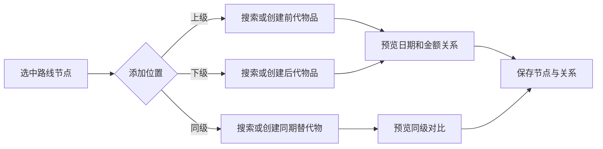

# 升级路线重构需求文档

> 文档状态：V1.1 已实现，待本地联调验收  
> 版本：V1.1  
> 日期：2026-07-27  
> 主要前端：`fronten2.0`
> 关联模块：物品中心、购买记录、出售记录、升级路线  
> 设计交付：Product Design 视觉方案 + Figma 可编辑原型  

## 1. 需求结论

升级路线应从现有的“年度升级计划时间线”重构为：

> 以真实物品为核心、能够表达上级／同级／下级关系，并自动计算购买时间、购买价差、出售回收和路线累计收支的可分支升级履历。

新版同时保留未来计划能力，但必须将“实际数据”和“计划数据”分开显示、分开汇总，避免计划预算与真实购买金额混算。

### V1.1 调整（2026-07-27）

- 移除路线计划年份、年度预算和独立计划商品入口；路线时间范围由真实物品最早／最晚主购买日期自动生成。
- 未来目标统一从心愿单选择。心愿被“标记已购买”并转换为物品后，原路线节点会自动替换为该物品，节点 ID 与关系保持不变。
- 同级节点可选“主物品”或“备用物品”：每层只有主物品参与上下级时间、价差和补款计算，备用物品仍计入路线总支出与总收入。
- 路线可设置一个“当前主物品”，用于标记现在正在使用的主商品；节点可重新选择关联物品并填写说明。
- 任何上下级变动都会按主线实际购买时间重新排序并重算各代关系。路线封面从前三个真实物品封面动态取图。

## 2. 背景与现状

### 2.1 已有能力

当前系统已具备：

- 升级路线新增、编辑、删除。
- 路线节点新增、编辑、删除。
- 节点连线新增、删除。
- 节点关联现有物品。
- 读取物品名称、图片、状态、购买日期和总投入。
- 读取出售记录并进行初步步骤成本计算。
- 计划年份、年度预算、计划预算、预计回收和计划状态。

### 2.2 现有问题

| 编号 | 问题 | 影响 |
| --- | --- | --- |
| EX-01 | 页面以线性时间线展示，已保存的节点连线未可视化 | 用户无法理解分支和上下级关系 |
| EX-02 | 路线、起点物品、节点和连线分别创建 | 第一次使用步骤多，容易产生不完整路线 |
| EX-03 | 起点物品和节点都要求手填数字 ID | 普通用户无法可靠完成操作 |
| EX-04 | `rootAssetId` 与首节点重复表达起点 | 数据可能不一致 |
| EX-05 | 仅提供粗略的步骤成本 | 缺少购买间隔、购买价差、使用时间和实际补款 |
| EX-06 | 路线汇总以计划预算为主 | 无法回答“这条升级路线实际花了多少钱” |
| EX-07 | 最近一笔出售记录没有限定主商品出售 | 配件出售可能被误用于主商品升级补款 |
| EX-08 | 缺少防环、孤立节点、重复物品等图结构校验 | 路线可能不可解释或无法正确汇总 |
| EX-09 | 实际节点和计划节点字段互相回退 | 金额口径不稳定 |

## 3. 产品目标

### 3.1 核心目标

1. 用户可以在一次流程中创建路线并添加第一件物品。
2. 用户可以选中任意一级物品，添加上级、同级或下级物品。
3. 路线图清楚展示图片、名称、购买时间、购买金额、使用时间和出售情况。
4. 每条前后代关系自动展示购买间隔、购买价差和出售后的实际升级补款。
5. 每条路线自动汇总真实总支出、出售收入和净投入。
6. 路线能表达分支，但计算结果仍然可解释、可追溯。

### 3.2 非目标

- 首期不根据市场价格自动推荐具体商品。
- 首期不预测二手出售价格。
- 首期不修改物品购买记录和出售记录的业务口径。
- 首期不自动把两个名称相似的物品关联成升级路线。
- 首期不实现多人协作、权限审批和公开分享。
- 首期不重构旧版 `frontend/` 页面。

## 4. 用户与使用场景

### 4.1 目标用户

- 长期记录数码产品购买、使用和出售情况的个人用户。
- 希望回顾设备迭代成本的发烧友。
- 希望规划下一次升级预算并比较候选商品的用户。

### 4.2 典型场景

1. 用户创建“手机升级路线”，选择 iPhone 13 Pro 作为第一件物品。
2. 用户选择该节点并添加下级 iPhone 15 Pro。
3. 系统显示两次购买相隔天数、购买价差和旧手机出售后的实际补款。
4. 用户再为 iPhone 15 Pro 添加同级 Pixel 9 Pro，作为同一阶段的对比或并行设备。
5. 用户继续添加下一代商品，路线形成纵向升级链和横向同级分支。
6. 用户查看整条路线的累计支出、出售净收入和实际净投入。

## 5. 业务定义

### 5.1 路线

路线是围绕一个主题形成的物品升级关系集合，例如：

- 手机升级路线
- 主力相机升级路线
- 通勤耳机升级路线
- 家庭影音升级路线

路线字段：

| 字段 | 必填 | 说明 |
| --- | --- | --- |
| 名称 | 是 | 最长 200 字 |
| 说明 | 否 | 最长 2000 字 |
| 路线类型 | 是 | `ACTUAL` 实际履历、`PLAN` 规划、`MIXED` 混合 |
| 路线状态 | 是 | `ACTIVE` 进行中、`COMPLETED` 已完成、`ARCHIVED` 已归档 |
| 年度预算 | 否 | 只用于计划对比，不替代实际支出 |
| 计划年份 | 否 | 年度规划使用 |

### 5.2 节点

节点代表路线中的一个实际物品或未来计划商品。

节点类型：

- `ASSET`：关联物品中心中的真实物品。
- `PLANNED`：尚未购买的计划商品。

实际物品节点必须以物品中心数据为准。计划节点购买后可以关联或转换为真实物品节点。

### 5.3 关系

关系分为：

- `SEQUENCE`：前后代关系，参与时间和资金计算。
- `ALTERNATIVE`：同级替代或对比关系，不参与前后代升级补款计算。

界面操作语义：

| 操作 | 数据结果 |
| --- | --- |
| 添加上级 | 新节点通过 `SEQUENCE` 指向当前节点 |
| 添加下级 | 当前节点通过 `SEQUENCE` 指向新节点 |
| 添加同级 | 新节点与当前节点形成 `ALTERNATIVE` 关系并显示在同一层 |

## 6. 核心用户流程

### 6.1 创建路线


要求：

- 创建过程分为“路线信息”和“第一件物品”两步。
- 第一个物品通过名称、品牌、分类搜索，不允许手填 ID。
- 路线与首节点必须在同一后端事务中创建。
- 创建失败时不得留下空路线。
- 暂不选择真实物品时，可选择创建计划路线并填写第一个计划商品。

### 6.2 添加关联物品



要求：

- 节点选中后出现“添加上级、添加同级、添加下级”快捷操作。
- 保存节点时由系统自动生成关系，不再提供独立的“添加连线”作为主入口。
- 允许新增多个下级形成分支。
- 添加上级时，如果当前节点已有上级，必须选择：
  - 插入当前关系中间。
  - 新增另一条上级分支。
- 同一个物品在同一路线中默认只能出现一次。

### 6.3 查看和维护路线

- 点击节点打开详情抽屉。
- 抽屉展示购买、使用、出售和关系信息。
- 支持跳转物品详情。
- 支持修改节点标签、说明和排序。
- 从路线移除节点时，不删除物品中心中的物品。
- 删除有后代的节点时，必须提示后代关系处理方式。

## 7. 页面与交互需求

### 7.1 页面总体结构

桌面端目标尺寸：1440 × 1024。

页面从上到下包括：

1. 页面标题、路线选择和新建路线。
2. 路线真实收支摘要。
3. 路线图／明细表视图切换。
4. 分层路线画布。
5. 节点详情抽屉或添加关系抽屉。

继续使用 `fronten2.0` 设计语言：

- 黑色固定侧栏。
- 荧光绿主操作和选中状态。
- 浅灰页面背景。
- 大圆角白色卡片。
- 深色收支摘要区域。
- 字体沿用 `"Noto Sans SC", "Microsoft YaHei", system-ui`。

### 7.2 路线摘要

路线顶部展示：

| 指标 | 说明 |
| --- | --- |
| 物品数量 | 去重后的真实物品节点数 |
| 累计总支出 | 全部购买记录之和 |
| 主商品支出 | `PRIMARY` 购买记录之和 |
| 配件及服务支出 | `ACCESSORY + SERVICE` |
| 累计出售净收入 | 全部相关出售记录净收入 |
| 实际净投入 | 累计总支出减累计出售净收入 |

年度预算存在时，另行展示“预算使用率”，不得替代真实收支。

### 7.3 物品节点卡片

实际物品节点展示：

- 商品图片或默认占位。
- 商品名称。
- 品牌、型号。
- 物品状态。
- 购买日期。
- 主商品购买金额。
- 总投入。
- 使用天数。
- 出售日期和出售净收入；未出售时显示当前状态。

计划节点展示：

- 目标商品名称。
- 计划周期。
- 计划预算。
- 预计回收。
- 计划状态。
- 明显的“计划”视觉标识。

节点状态：

- 默认。
- 悬停。
- 选中。
- 已出售。
- 当前使用。
- 计划节点。
- 数据不完整。

### 7.4 关系连线

`SEQUENCE` 连线展示：

- 购买间隔，例如“396 天后”。
- 购买价差，例如“购入价 +¥2,000”。
- 前代已出售时显示“实际补款 ¥5,500”。
- 前代未出售时显示“出售后计算”。

`ALTERNATIVE` 关系使用弱化虚线，不显示实际升级补款。

### 7.5 节点详情抽屉

抽屉包含：

1. 物品摘要。
2. 购买数据。
3. 使用数据。
4. 出售数据。
5. 与直接上级、下级的计算结果。
6. 节点操作。

### 7.6 明细表视图

提供表格作为路线图的补充视图，列包括：

- 层级。
- 物品。
- 关系。
- 购买日期。
- 购买金额。
- 使用天数。
- 出售净收入。
- 与上级间隔。
- 购买价差。
- 实际升级补款。

## 8. 计算规则

### 8.1 数据源口径

- 主商品购买金额：该物品 `PRIMARY` 购买记录金额。
- 总投入：该物品全部购买记录金额之和。
- 主商品出售：`sale_scope = ASSET`。
- 配件出售：`sale_scope = ACCESSORY`。
- 实际补款只能使用上级主商品出售的 `netIncome`。

### 8.2 节点指标

```text
节点总投入
= 主商品购买 + 配件购买 + 服务购买

节点使用天数
= 已出售 ? 主商品出售日期 - 购买日期
         : 当前日期 - 购买日期
```

日期按自然日计算，最小为 0。缺少购买日期时返回 `null` 并标记数据不完整。

### 8.3 相邻级指标

```text
购买间隔天数
= 下级购买日期 - 上级购买日期

购买价差
= 下级主商品购买金额 - 上级主商品购买金额

实际升级补款
= 下级主商品购买金额 - 上级主商品出售净收入
```

规则：

- 只有 `SEQUENCE` 关系参与计算。
- 上级未出售时，实际升级补款返回 `null`。
- 日期为负数时保留结果并返回日期异常标记。
- 金额为负数表示下级更便宜或出售净收入高于下级购买金额。
- 每条相邻关系独立计算，不为“下下一级”编写特殊逻辑。

### 8.4 路线汇总

```text
累计总支出
= 路线中去重真实物品的全部购买记录之和

累计出售总额
= 路线中去重真实物品的全部 salePrice 之和

累计出售费用
= fee + shippingCost + otherCost

累计出售净收入
= 全部 netIncome 之和

实际净投入
= 累计总支出 - 累计出售净收入
```

计划节点不计入实际汇总。存在计划节点时另外返回计划预算、预计回收和预计净投入。

### 8.5 分支汇总

- 路线总计统计全部真实物品，不重复统计同一物品。
- 用户选定一条分支后，提供该路径的支出、收入和净投入。
- 多个计划同级备选不得全部累加为同一方案预算。

## 9. 数据完整性与校验

| 编号 | 校验规则 |
| --- | --- |
| VAL-01 | 同一路线中禁止重复添加同一个真实物品 |
| VAL-02 | 禁止节点连接自身 |
| VAL-03 | `SEQUENCE` 关系不得形成环 |
| VAL-04 | 新增关系的两个节点必须属于同一路线 |
| VAL-05 | 真实节点必须关联有效物品 |
| VAL-06 | 计划节点必须填写目标商品名称 |
| VAL-07 | 主商品购买日期或金额缺失时显示数据不完整 |
| VAL-08 | 出售日期早于购买日期时显示数据异常 |
| VAL-09 | 只有 `ASSET` 出售记录可标记主商品已出售 |
| VAL-10 | 已归档路线只读，恢复为进行中后方可编辑 |

## 10. 后端接口建议

### 10.1 创建路线和首节点

`POST /api/upgrade-routes`

```json
{
  "name": "手机升级路线",
  "remark": "记录主力手机的更换过程",
  "routeType": "ACTUAL",
  "status": "ACTIVE",
  "planYear": 2026,
  "annualBudget": 18000,
  "firstNode": {
    "nodeType": "ASSET",
    "assetId": 101
  }
}
```

路线和首节点必须在一个事务中创建。

### 10.2 基于锚点添加节点

`POST /api/upgrade-routes/{routeId}/nodes`

```json
{
  "anchorNodeId": 2001,
  "position": "AFTER",
  "nodeType": "ASSET",
  "assetId": 102
}
```

`position`：

- `BEFORE`
- `ALTERNATIVE`
- `AFTER`

后端自动创建节点和关系，并返回保存后的图增量及计算结果。

### 10.3 路线图响应

`GET /api/upgrade-routes/{routeId}/graph`

响应至少包括：

- `route`
- `actualSummary`
- `planSummary`
- `nodes`
- `links`
- `warnings`

节点新增字段建议：

- `nodeType`
- `assetStatus`
- `coverImageUrl`
- `purchaseDate`
- `primaryPurchaseAmount`
- `totalInvest`
- `useDays`
- `mainSaleDate`
- `mainSalePrice`
- `mainSaleNetIncome`
- `dataWarnings`

连线新增字段建议：

- `relationType`
- `purchaseGapDays`
- `purchasePriceDelta`
- `replacementNetOutflow`
- `calculationStatus`

### 10.4 兼容性

- 保留现有路线查询接口路径。
- 旧节点默认映射为 `ASSET` 或 `PLANNED`。
- 旧连线默认映射为 `SEQUENCE`。
- `rootAssetId` 标记为兼容字段，新版以首节点为准。
- 数据库变更必须增加新的 Flyway 迁移脚本，不修改已执行的 `V1__init.sql`。

## 11. Figma 原型范围

最终 Figma 文件至少包含以下页面或状态，名称与需求编号一致：

| 原型编号 | 画面 |
| --- | --- |
| FG-01 | 升级路线列表／默认路线图 |
| FG-02 | 新建路线：路线基本信息 |
| FG-03 | 新建路线：选择第一件物品 |
| FG-04 | 新建路线：确认并创建 |
| FG-05 | 选中节点后的快捷操作 |
| FG-06 | 添加上级商品 |
| FG-07 | 添加同级商品 |
| FG-08 | 添加下级商品及计算预览 |
| FG-09 | 前代已出售时的实际升级补款 |
| FG-10 | 多分支路线图 |
| FG-11 | 节点详情抽屉 |
| FG-12 | 路线明细表 |
| FG-13 | 数据不完整／日期异常提示 |
| FG-14 | 空路线和加载／失败状态 |

Figma 要求：

- 画板尺寸 1440 × 1024。
- 沿用 `fronten2.0` 的视觉语言和桌面侧栏。
- 重复节点卡片、关系标签、按钮和状态标记必须组件化。
- 页面、弹窗、抽屉和主要状态保持可编辑。
- 使用真实中文业务文案和可信示例数据。
- 原型连线顺序必须覆盖从创建路线到查看汇总的完整流程。

## 12. 验收标准

### 12.1 创建路线

- 用户无需输入任何数据库 ID。
- 选择第一件物品后可一次完成创建。
- 创建成功后路线图中恰好存在一个首节点。
- 任一步失败时不产生空路线或孤立节点。

### 12.2 添加关系

- 任意实际节点均可添加上级、同级和下级。
- 上下级自动产生 `SEQUENCE` 关系。
- 同级自动产生 `ALTERNATIVE` 关系。
- 页面不要求用户另行添加连线。
- 形成环或重复物品时保存被阻止，并给出明确原因。

### 12.3 计算

假设：

- 上级购买日期：2023-01-01。
- 上级购买金额：¥8,000。
- 上级出售净收入：¥4,500。
- 下级购买日期：2024-02-01。
- 下级购买金额：¥10,000。

系统必须展示：

- 购买间隔：396 天。
- 购买价差：+¥2,000。
- 实际升级补款：¥5,500。

上级未出售时，“实际升级补款”显示“出售后计算”，不得使用 0 元代替。

### 12.4 汇总

- 同一物品即使参与多条关系也只统计一次。
- 实际汇总不包含计划节点预算。
- 累计出售净收入使用 `netIncome`。
- 配件出售不得将主商品标记为已出售。
- 路线总计与物品购买、出售明细逐项相加结果一致。

### 12.5 视觉与交互

- 1440 × 1024 下页面无裁切和重叠。
- 选中节点、当前使用、已出售、计划和异常状态可辨识。
- 路线图与明细表展示相同数据。
- 主要操作具备键盘焦点状态。
- 信息不只依赖颜色表达。

## 13. 实施优先级

### P0

- 创建路线并选择第一件物品。
- 搜索选择物品，移除手填 ID。
- 添加上级／同级／下级。
- 分层路线图及关系标签。
- 购买间隔、购买价差、实际升级补款。
- 路线真实支出、出售收入和净投入。
- 主商品与配件出售口径修正。
- 防环、重复物品和数据异常校验。

### P1

- 计划节点及购买后转真实物品。
- 分支方案汇总。
- 路线明细表。
- 导出长图或 PDF。
- 升级周期和折损分析。

### P2

- 预算提醒。
- 年度升级报告。
- 二手出售时机提示。
- 基于历史数据的升级成本预测。

## 14. 风险与待确认项

| 项目 | 风险 | 建议 |
| --- | --- | --- |
| 同级语义 | 可能表示“备选”或“同时拥有” | 节点增加同级用途标签，汇总按真实／计划分别处理 |
| 多上级节点 | 插入上级时关系处理存在歧义 | 保存前明确选择插入或新增分支 |
| 资产记录修改 | 路线历史金额会随源数据变化 | 首期保持实时引用，并在路线显示“数据更新于” |
| 删除物品 | 可能导致路线节点失效 | 物品删除前提示引用路线，保留节点快照作为后续增强 |
| 计划备选汇总 | 多个备选全量相加会夸大预算 | 计划汇总按选定路径或方案计算 |

## 15. 设计与开发追踪

| 交付物 | 状态 |
| --- | --- |
| 代码级现状分析 | 已完成 |
| 正式需求文档 | 已完成 |
| Product Design 三个视觉方向 | 已完成 |
| 用户选择视觉方向 | 已确认：方向 3 |
| 设计变量与组件库 | 已完成 |
| Figma 可编辑原型 | 已完成：FG-01～FG-14 |
| Figma 关键流程交互 | 已完成：21 个跳转／选择动作 |
| Figma 与需求编号复核 | 已完成 |
| 前后端开发 | 未开始 |

Figma 原型：

- [DigiLedger｜升级路线重构原型 V1](https://www.figma.com/design/le53gTc0y3WGN5bXzRnyAJ)
- 原型画布尺寸：1440 × 1024。
- 示例代际：第一代（2024 年 02 月）、第二代（2025 年 06 月）、第三代（2026 年 09 月）。
- 示例财务：总支出 ¥17,400、总收入 ¥6,800、净投入 ¥10,600。

### 15.1 原型页面覆盖

| 编号 | 页面／状态 | 核心验证点 |
| --- | --- | --- |
| FG-01 | 路线列表 | 路线汇总、三代缩略图、进入详情 |
| FG-02 | 创建升级路线 | 名称、分类、开始年月、目标说明 |
| FG-03 | 选择首件物品 | 搜索、筛选、选择已有物品 |
| FG-04 | 创建完成 | 第一代节点和后续操作引导 |
| FG-05 | 路线详情 | 三代年月、商品节点、关系差值、检查器 |
| FG-06 | 添加关联商品 | 上级／同级／下级选择和商品选择 |
| FG-07 | 确认上级关系 | 时间差、购买价差、跨级收益提示 |
| FG-08 | 确认同级关系 | 同级用途及不改变主线代次 |
| FG-09 | 确认下级关系 | 负向时间差、价格差和备用关系 |
| FG-10 | 出售与跨级收益 | 出售表单及下下级购买差价 |
| FG-11 | 路线财务汇总 | 总支出、总收入、净投入、日均成本 |
| FG-12 | 路线筛选与视图 | 状态、关系、代际、年月和指标筛选 |
| FG-13 | 编辑升级路线 | 基础信息修改及影响范围 |
| FG-14 | 删除升级路线 | 删除影响、保留数据和二次确认 |

### 15.2 2026-07-29 路线图展示与核算修订

- 路线详情按代际倒序展示，最新代在最左侧，第一代位于最后；代际编号始终取节点实际层级，不因展示排序改变。
- 所有路线内的使用时长和前后代购买间隔统一显示为“X年X个月（Y天）”；月数按 30 天近似换算，用于快速比较周期，原始天数保留在括号内。
- 同级关系只在同一代纵向展示。代际由用户添加上级、同级、下级时的结构位置决定，购买日期仅用于计算间隔；每组同级节点只能有一个主物品参与前后代计算，用户将同级物品设为主物品时，原主物品自动转为备用物品。
- 新增同级物品默认角色为备用物品；只有用户主动设置为同级主物品时才替换该代计算主物品。
- 对历史版本已错误排为不同代际的同级节点，路线图读取时会自动恢复到其锚点代际，无需用户逐项重建。
- 日均成本定义为：`（路线真实总支出 - 出售净收入）÷ 路线实际履历天数`。履历天数从最早主商品购买日期计算至仍持有物品的当天，若全部已出售则计算至最后出售日期；不再累加多件物品的重叠使用天数。
